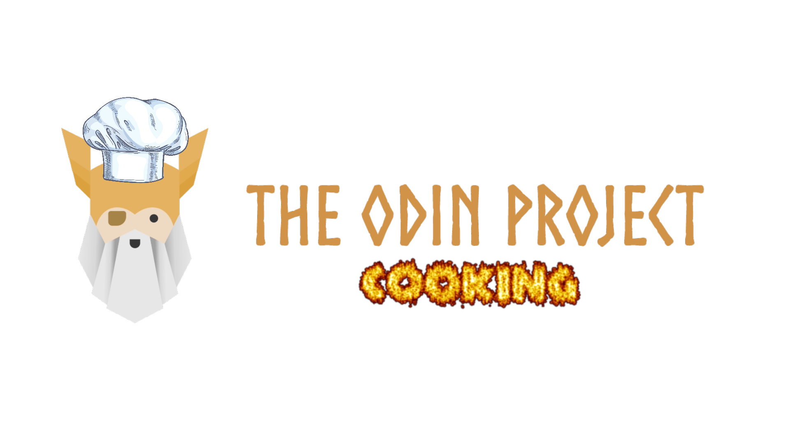

# Odin Recipes Website

## Live Web 

[Click here](https://juanmontill.github.io./odin-recipes_website)

## 🤝 Contributing

Contributions, issues and feature requests are welcome!

Feel free to check the [issues page](https://github.com/JUANMONTILL/odin-recipes_website/issues).

## Geeting Started

1. Clone this repository on your local machine.

2. Open the index.html file in the browser.

3. Enjoy.

## Acknowledgments

- My family.
- My teachers.

## 📝 License

This project is [CC0-1.0](LICENSE) licensed.

## Author

**Juan Montilla**

- GitHub [JUANMONTILL](https://github.com/JUANMONTILL)
- Instagram [juanfranc_31](https://instagram.com/juanfranc_31)